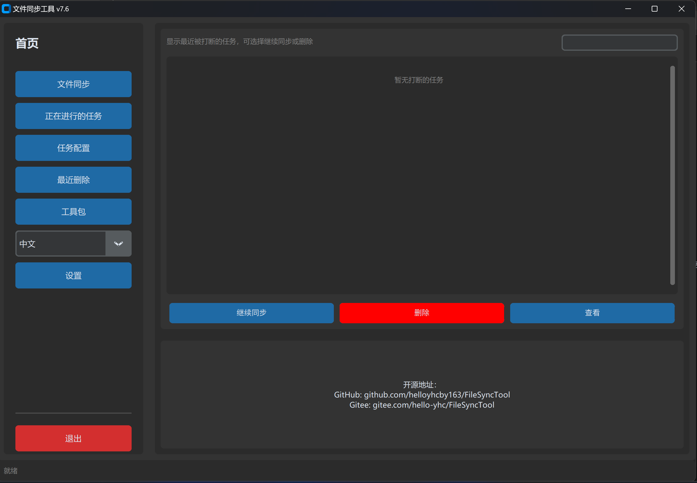
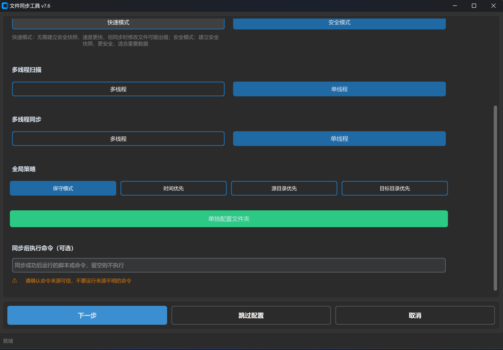
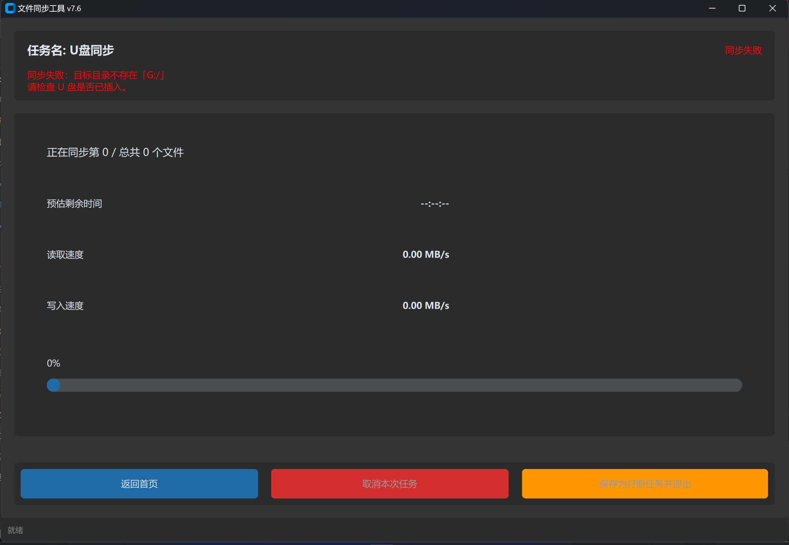
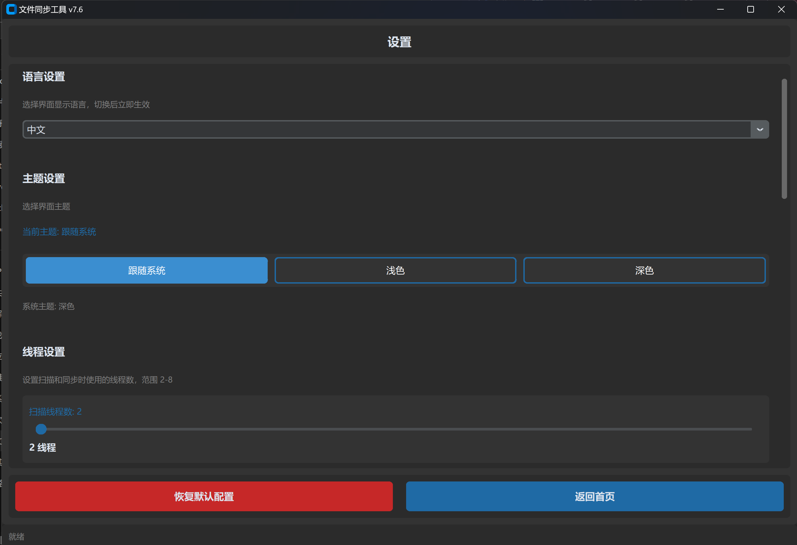

# FileSyncTool 帮助文档

FileSyncTool 是一款跨平台（Windows / macOS / Linux）文件同步工具，支持双向/单向同步、U 盘写入寿命保护、冲突策略、命令行自动化与后台监听。本文介绍快速上手、各功能用法、命令行参数、常见问题与网络加速指引。

## 快速上手

1. **新建任务**：首页点击「文件同步」→「新建任务」，填写任务名、源目录、目标目录与同步方向。
2. **开始同步**：在确认页核对信息后点击「开始同步」，可在进度页暂停、中断或恢复。
3. **管理任务**：「任务配置」页可编辑、删除、导入、导出任务；「正在进行的任务」页实时显示进度。
4. **工具包**：后台监听、系统快捷方式、同步后自动关机、帮助文档等功能集中在「工具包」页。

主要功能一览：

- 双向 / 单向同步、快速模式与安全模式
- 五种冲突策略、大文件分块复制、断点续传
- U 盘写入寿命保护、同步删除回收站
- 任务级筛选策略（扩展名 + 日期）
- 三语言界面（简体中文 / English / 繁體中文），支持外挂语言文件
- 命令行单次执行与后台监听

## 创建任务

在首页选择「文件同步」→「新建任务」：

1. 填写任务名称、源目录、目标目录。
2. 选择同步方向：双向、仅源→目标、仅目标→源。
3. 选择运行模式：**快速模式**速度优先；**安全模式**先写临时文件再替换，可防止中断导致数据损坏。
4. 「全局策略」设置默认冲突处理；点击「单独配置文件夹」可为每个顶层子文件夹单独指定策略与筛选规则。
5. 可选：填写「同步成功后执行的命令」（留空不执行，命令非阻塞运行，**请确认命令来源可信**）。

冲突策略说明：

- **保守模式**：发现冲突时跳过，不覆盖已有文件。
- **时间优先**：以修改时间较新的文件为准。
- **源目录优先 / 目标目录优先**：始终以指定一侧的文件为准。
- **不同步**：跳过该文件夹。

筛选策略可按文件夹配置扩展名白/黑名单与日期范围，二者为 AND 关系；未配置的文件夹同步全部文件。

## 执行同步

点击「开始同步」后进入同步进度页，实时显示当前阶段、当前文件、已完成/总文件数、传输速度、已用时间与预估剩余时间。同步过程中可以：

- **暂停 / 恢复**：临时挂起复制。
- **中断**：中断后可将任务保存为「打断任务」，下次从首页继续。
- 同步完成后，若有文件被 Windows Defender 等安全软件拦截，会弹窗列出具体文件路径，可放行后重试。
- 启用「同步删除」时，被删除的文件进入「最近删除」页，可恢复或彻底清除。

若同步开始前检测到源目录或目标目录不存在（常见于 U 盘未插入），会明确提示是哪一侧目录缺失并显示完整路径，例如：

> 同步失败：目标目录不存在「E:\照片」
> 请检查 U 盘是否已插入。

## 设置

「设置」页提供全局配置：

- **语言**：简体中文 / English / 繁體中文（自动扫描内置与外挂语言目录）。
- **主题**：跟随系统 / 浅色 / 深色。
- **线程数**：扫描线程与同步线程数。
- **写入寿命保护**：针对 U 盘等可移动介质，合并小写入、定期停歇，减少擦写次数。
- **同步删除**：默认开关与回收站容量上限。
- **同步时阻止系统休眠**：默认开启，同步全程（含寿命保护暂停期间）阻止电脑休眠，结束后自动恢复。
- **外挂语言目录**：显示目录路径并可用文件管理器打开，自定义翻译文件放入后重启生效。
- **配置存储路径**：可将配置目录切换到自定义位置。

同步后自动关机在「工具包 → 同步后操作」中配置：勾选后，仅当本批**全部任务成功**时才在设定延迟（30 / 60 / 120 秒）后关机；倒计时显示在窗口底部状态栏，可随时点击「取消关机」。任一任务失败都会取消关机、弹窗提示，并把失败任务保存为打断任务。

## 命令行用法

FileSyncTool 支持无界面命令行模式（Windows 下可直接使用打包后的 `FileSyncTool.exe`）：

| 命令 | 说明 |
| --- | --- |
| `FileSyncTool` | 启动图形界面 |
| `FileSyncTool --help` | 显示帮助 |
| `FileSyncTool --list-tasks` | 列出所有任务 |
| `FileSyncTool --task "任务名"` | 执行指定任务 |
| `FileSyncTool --task "任务名" --silent` | 静默执行（仅输出摘要、警告与错误） |
| `FileSyncTool --watch "任务名"` | 后台监听指定任务 |
| `FileSyncTool --watch "任务名" --idle 10` | 指定空闲触发秒数（默认 10，范围 3-300） |

示例：

- `FileSyncTool --task "备份照片" --silent`
- `FileSyncTool --watch "同步文档"`

开发环境中将 `FileSyncTool` 替换为 `python main.py` 即可。

**后台监听说明**：

- `--watch` 是独立的命令行常驻模式，不依赖 GUI，Ctrl+C 退出。
- 工具包页面的「监听任务」按钮，本质上是以子进程方式启动 `--watch`；关闭 GUI 后监听继续运行。
- 重新打开程序后，可在「工具包 → 查看监听详情」中查看并停止监听。
- 监听期间任务被删除会自动停止；任务源目录被修改会自动重新监听新目录。

## 常见问题

**Q：未插 U 盘时提示什么？**
A：程序会区分源目录和目标目录不存在的情况，显示具体路径，并提示「请检查 U 盘是否已插入」。

**Q：有些文件没同步成功？**
A：同步完成后若有文件被安全软件拦截，程序会弹窗列出被拦截的文件路径（最多显示前 10 个及总数）。请确认文件安全后在安全软件中放行，再重试。

**Q：如何在另一台电脑上恢复任务？**
A：在工具包页面使用「导出所有任务」生成 JSON 文件，在另一台电脑上「导入任务」即可。

**Q：后台监听关闭程序后还会运行吗？**
A：会。监听以独立子进程运行，关闭 GUI 后继续监听；重新打开程序可在「查看监听详情」中停止。

**Q：同步时电脑会休眠吗？**
A：默认不会。设置页的「同步时阻止系统休眠」默认开启，同步（含寿命保护暂停）全程保持唤醒，同步结束后自动恢复系统休眠策略。

**Q：自动关机误触了怎么办？**
A：全部任务成功后的关机有 30/60/120 秒延迟，窗口底部状态栏会显示倒计时与「取消关机」按钮；关机由系统计时器执行，即使关闭了 GUI，也可在终端执行 `shutdown /a`（Windows）取消。

**Q：程序崩溃了怎么办？**
A：崩溃时会弹出错误对话框，点击「查看详细信息」可在终端中查看完整日志，便于反馈给开发者。

**Q：如何自定义界面语言？**
A：按照 `translations/zh.json` 的格式编写自定义语言文件，放入设置页所示的「外挂语言目录」，重启后在语言列表中选择即可。

## 网络加速

> **免责声明**：本节仅提供第三方工具的信息指引，本程序不集成、不调用、不控制任何第三方加速服务，也不对其可用性、安全性与合法性负责。请自行评估风险并遵守当地法律法规。

当访问 GitHub 等代码仓库或下载依赖较慢时，可参考以下加速方案。

### 推荐工具（桌面客户端）

| 工具 | 说明 | 官方链接 |
| --- | --- | --- |
| **FastGithub** | 加速 GitHub 访问，Windows 版通常开箱即用 | https://github.com/dotnetcore/FastGithub |
| **Watt Toolkit（原 Steam++）** | 多平台加速工具，支持 GitHub 等 | https://github.com/BeyondDimension/SteamTools |
| **dev-sidecar** | 开发者加速助手，支持 GitHub/Gitee | https://github.com/docmirror/dev-sidecar |

Windows 版本一般下载后直接运行即可生效；macOS/Linux 请参考各自项目的 README 进行配置。

### 轻量替代方案（无需安装）

若仅需临时下载 GitHub 资源，可使用网页代理在原始 URL 前加前缀：

- **gh-proxy.com**：`https://gh-proxy.com/https://github.com/...`
- **bgithub.xyz**：`https://bgithub.xyz/https://github.com/...`
- **ghproxy.com**：`https://ghproxy.com/https://github.com/...`

适用于克隆仓库、下载 Release 附件等场景。

### 使用建议

- 优先使用官方渠道获取加速工具，避免从非官方站点下载。
- 如不再需要加速，及时关闭或卸载相关工具，恢复正常网络配置。
- 如遇加速工具失效，请前往其官方仓库查看最新版本或替代方案。

遇到问题或有功能建议，欢迎提交 Issue：

- GitHub：https://github.com/helloyhcby163/FileSyncTool
- Gitee：https://gitee.com/hello-yhc/FileSyncTool
